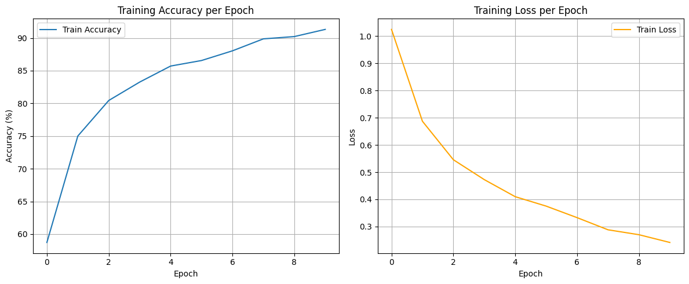
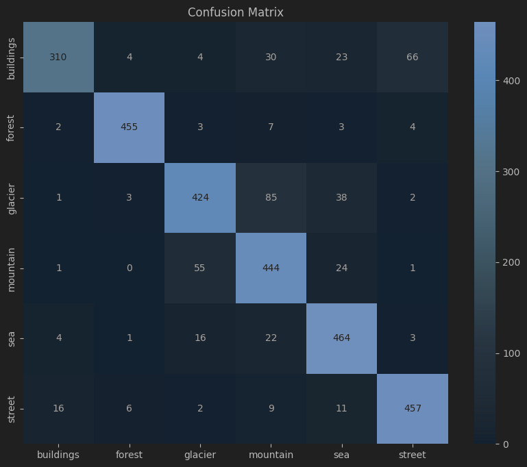

## AlexNet implementation on PyTorch

#### The CNN is trained on Intel Image Classification Dataset from Kaggle which can be found [here](https://www.kaggle.com/datasets/puneet6060/intel-image-classification).

The dataset is contains 3 folders:

seg_pred, seg_test, seg_train

### Recommended folder structure:

<br>

```plaintext
pred_data
    |-images...
test-data
    |-class-1
        |-images...
    |-...
    |-class-6
train_data
    |-class-1
        |-images...
    |-...
    |-class-6
AlexNet.ipynb       # Notebook
```
<br>

### Train Accuracy and Loss over Epoch 



### Confusion Matrix



### The final accuracy was 91.31% for training data and 85.13% for test data.