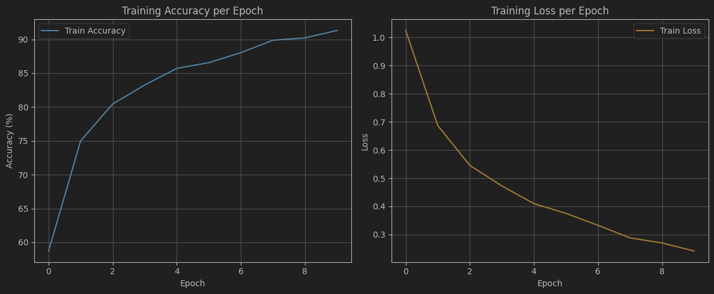

## AlexNet implementation on PyTorch

#### The AlexNet is trained on Intel Image Classification Dataset from Kaggle found [here](https://www.kaggle.com/datasets/puneet6060/intel-image-classification).

The dataset contains 3 folders (seg_pred, seg_test, seg_train)

### Recommended folder structure


```plaintext
seg_pred        # Prediction Data
seg_test        # Test Data
seg_train       # Train Data
AlexNet.ipynb   # Notebook file
```


### Train Accuracy and Loss over 10 Epochs 



### Confusion Matrix


### The final accuracy was 91.31% for training data and 85.13% for test data.